# Draw|deepin-draw|

## Overview

Draw is a simple drawing tool, supporting rotation, cropping, flipping, and adding texts and shapes among other functions. You can edit local pictures or draw pictures freely.

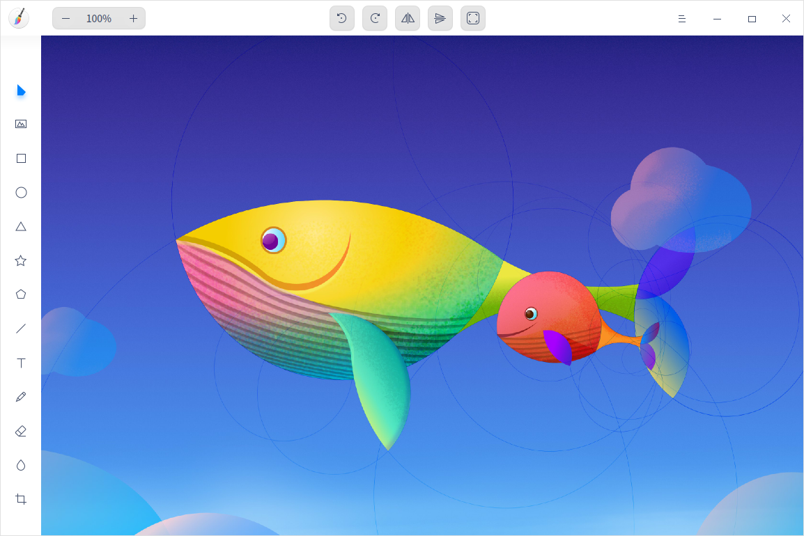

## Guide

You can run, close, and create shortcuts for Draw in the following ways.

### Run Draw

1. Click the Launcher icon  in the Dock to enter the Launcher interface.
2. Locate Draw  by scrolling the mouse wheel or searching "draw" in the Launcher interface.
3. Right-click  and the user can:
 - Click **Send to desktop** to create a desktop shortcut.
 - Click **Send to dock** to fix the application in the Dock.
 - Click **Add to startup** to add the application to startup and it will automatically run when the system starts up.

Tips: In Control Center, you can set Draw as the defaulted picture viewer. Please refer to [Default Applications](dman:///dde#Default Applications) for specific operations.

### Exit Draw

- On the Draw interface, click  to exit Draw.
- Right-click  in the Dock and select **Close All** to exit Draw.
- Click  on the Draw interface and select **Exit** to exit Draw.

### View Shortcuts

On the Draw interface, press **Ctrl** + **Shift** + **?** on the keyboard to view shortcuts. Proficiency in shortcuts will greatly improve your efficiency.

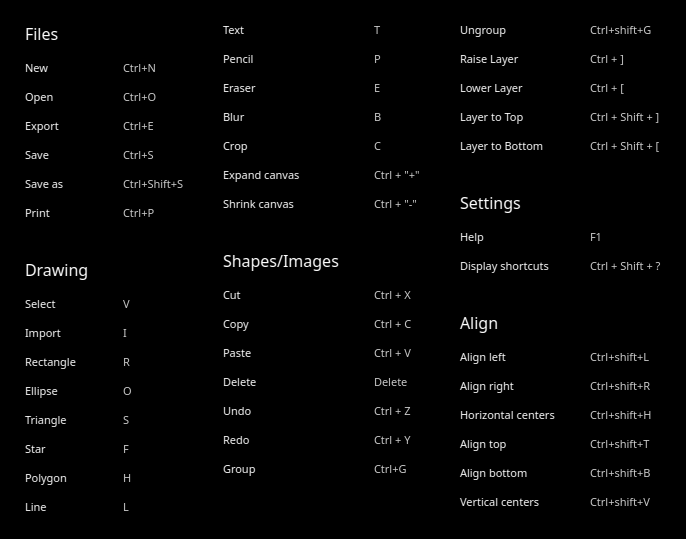

## Basic Functions

With Draw, you are able to process imported pictures and draw pictures freely. You can also export pictures in multiple formats.

### Create tabs

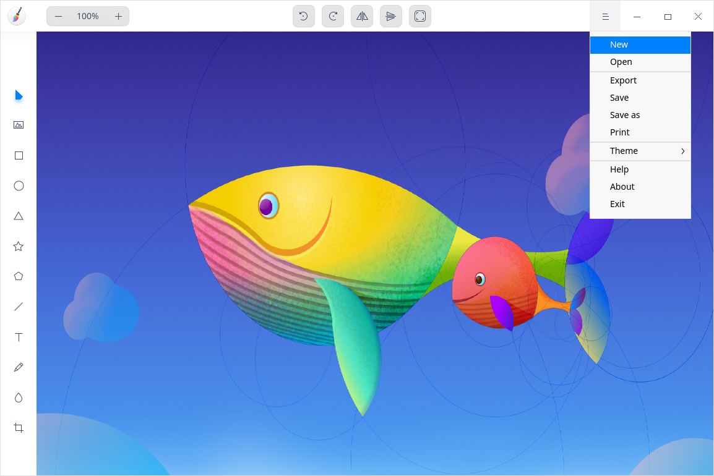
&nbsp;&nbsp;&nbsp;&nbsp;&nbsp;&nbsp;&nbsp;&nbsp;&nbsp;&nbsp;&nbsp;&nbsp;&nbsp;

- On the Draw interface, click > **New** to create a new tab.
- You can also click  to create a new tab when there are two or more tabs in the window.

### Close tabs

- Click a tab. Then click  on the tab to close the current tab.
- Right-click a tab. Select **Close tab** or **Close other tabs**. 

### Open Pictures

1. On the Draw interface, click or   > **Open**.
2. Select the picture to be imported and click **Open**.

Currently, a maximum of 30 pictures could be imported. Formats including JPG, PNG, TIF, BMP and DDF are supported.

### Export Pictures

1. On the Draw interface, click > **Export**.
2. Set the parameters including file name, path, format, and picture quality. 
3. Click **Save**. 

### Save Pictures

1. On the Draw interface, click > **Save** or > **Save as**.
2. Set the file name and format to be saved.
3. Click **Save**.

>  Notes: The suffix of the file name can be omitted and it can be saved as the selected format automatically. 

### Print Pictures

1. On the Draw interface, click > **Print**.
2. Select the printer and set the printing parameters.
3. Click **Print**.

>  Notes: Click **Advanced** to customize the printing parameters.

## Drawing Tools

With the drawing tools of Draw, you can give full play to your imagination and creativity for free graphic drawings. 

### Shape Tool

1. On the Draw interface, click  ,  ,, or .
2. You can set the parameters for graphics as follows:
 - Click **Fill** to set the fill color and transparency for graphics.
 - Click **Stroke** to set the stroke color and transparency for graphics pen.
 - Choose and set the weight of Stroke from the drop-down list right to the **Stroke** button.
 - Click **Points** (from 3 to 50) and **Radius** (from 0% to 100%) to set the points and radius for star graphics only.
 - Click **Sides** (from 4 to 10) to set sides for polygon graphics only. 

   > Tips: The number of sides, points and radius can be adjusted by clicking  or  on the attribute column, scrolling the mouse wheel or pressing  or on the keyboard after selecting the value of sides, points or radius.
3. Drag the mouse to draw graphics in the canvas area. 

> Tips: Facilitated by **Shift** or **Shift + Alt** on the keyboard, you can draw a square, circle, equilateral triangle, regular pentagram, and regular pentagon when drawing graphics with , , ,  and .

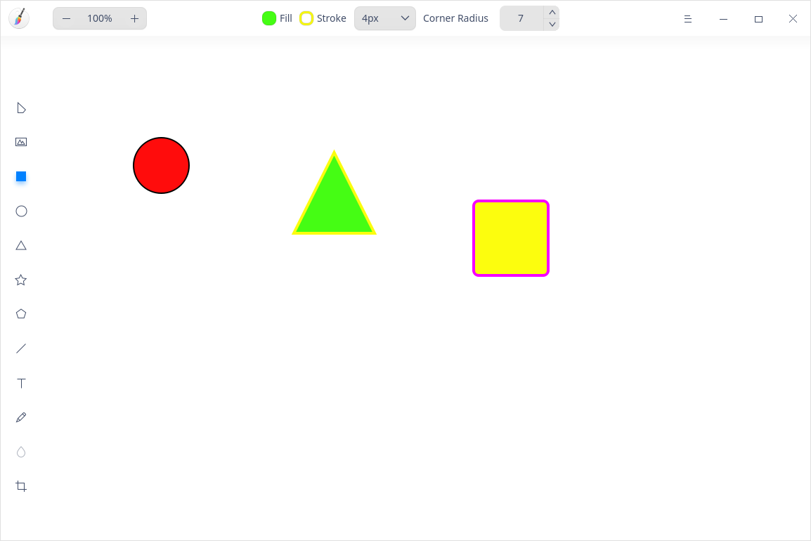

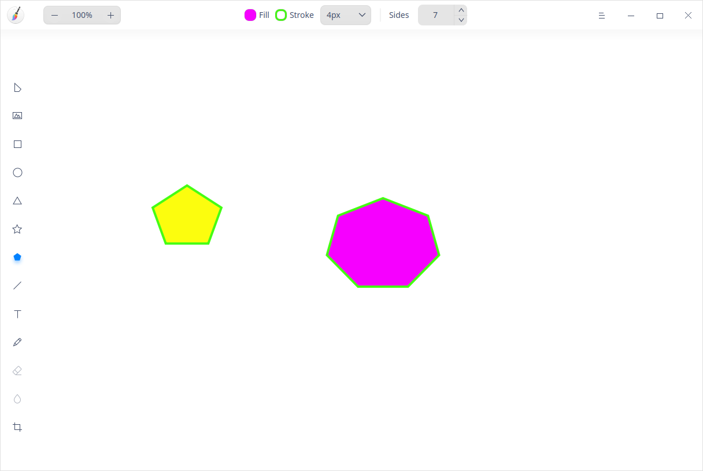

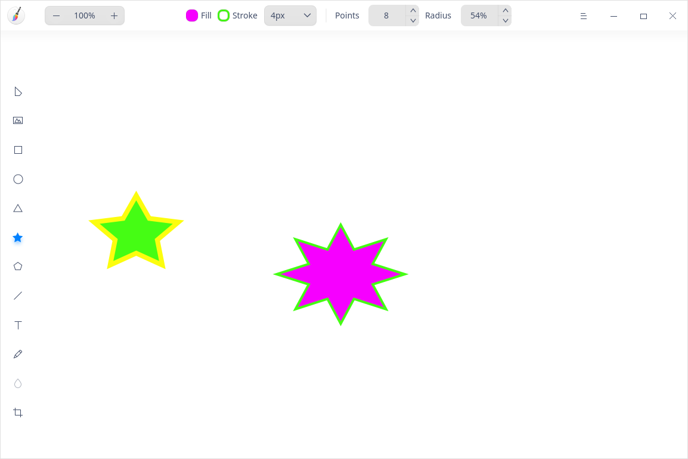

### Line Tool

1. On the Draw interface, click .

2. You can set parameters for your lines in the attributes column as follows:
   - Click **Stroke** to set the color and transparency of the line.
   - Select the weight of line from the drop-down list. 
   - Click **Start** and **End** to choose the style of starting point and ending point of lines.

3. Drag the mouse in the canvas area to draw lines.

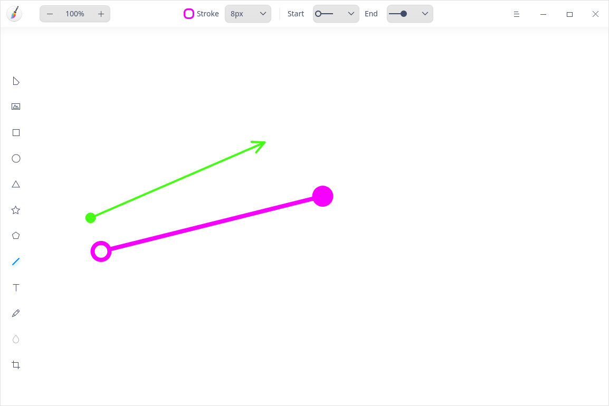

### Text Tool

1. On the Draw interface, click .

2. You can set text styles as follows:
   - Click **Color** to set the fill color and transparency of texts.
   - Select the font style in the **Font** drop-down list.
   - Select regular font or bold font in the drop-down list.
   - Adjust the **Size** by entering a value manually or selecting a size in the drop-down list.
   
3. Click in the canvas area to enter texts in the text box.
   &nbsp;&nbsp;&nbsp;&nbsp;&nbsp;&nbsp;&nbsp;&nbsp;&nbsp;&nbsp;&nbsp;&nbsp;&nbsp;

>Tips: You can use shortcuts to adjust the font size. When font is under editing,  click the font size right to the **Size** icon and click the  or  key on the keyboard to adjust the font size.

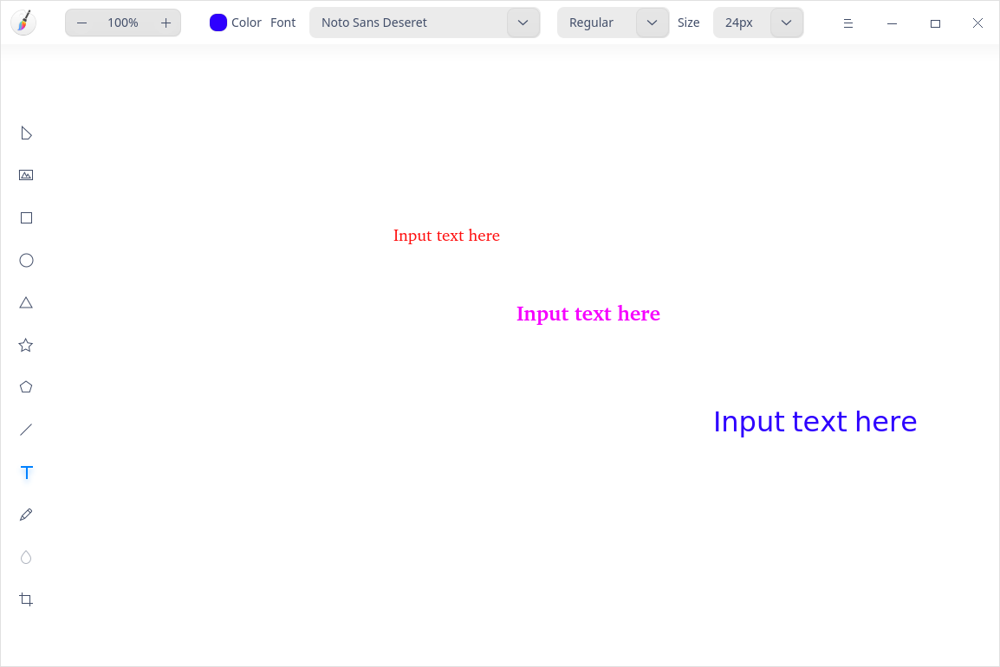

### Pencil Tool

1. On the Draw interface, click .
2. You can set parameters for your pencil in the attributes column as follows:
   - Click **Stroke** to set the color and transparency of the pencil.
   - Select the pencil needed from the drop-down list. 
   - Select the weight of the pencil from the drop-down list. 
3. Drag the mouse on the canvas area to draw graphics.
4. Click the icon to select and edit the graphic.

### Eraser Tool

1. On the Draw interface, import a picture or draw a graphic with the pencil.
2. Click the  icon and set the width for the eraser in the attributes column.
3. Hold on and drag the left key of the mouse to erase the part of the picture or graphic  as needed. 

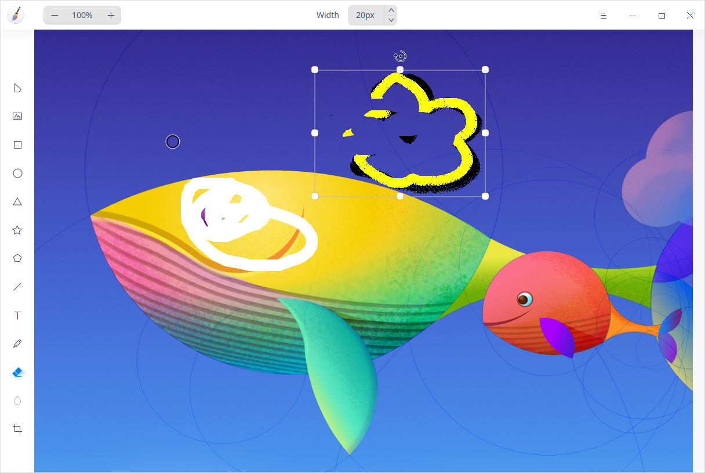

### Blur Tool

1. On the Draw interface, import a picture and click .
2. Select the blur **Type**.
3. Change the blur area width by clicking the up or down arrow in **Width**.
4. Drag the mouse in the canvas area to blur the area as needed.

>  Notes: The blur tool is only applicable for pictures.

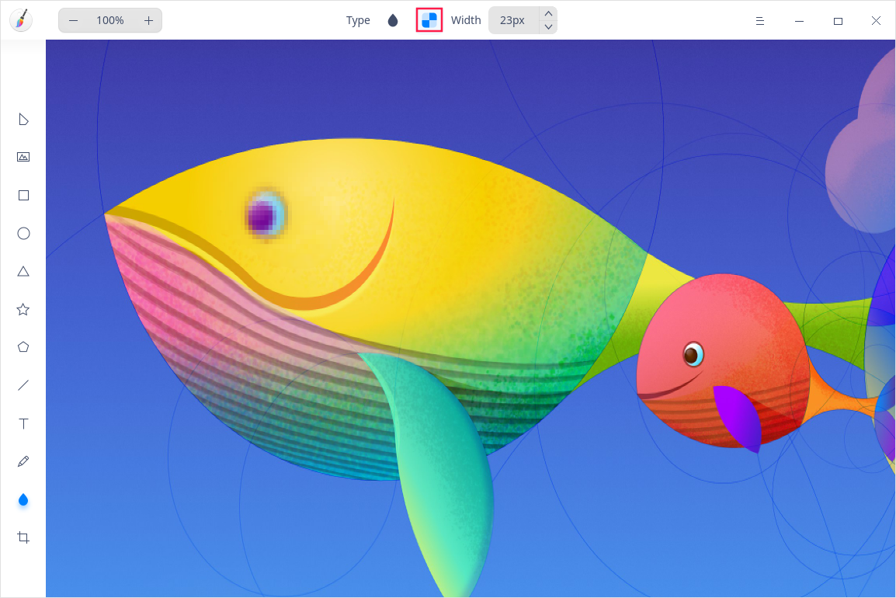

## Edit Functions

You can copy, crop, and rotate graphics with the editing functions, and also adjust layer and texts.

### Select

After drawing entities with the graphics drawing tool, you can perform the following operations:

- Select drawn graphics or texts.
- Perform marquee selection and all graphics within the marquee selection area are put under selected status.
- Drag to adjust the size of the graphic within the selected area.
- Hold down the **Shift** key and click to select multiple graphics.

>  Notes: Click the blank area in Draw to cancel the graphics selected.

### Crop

1. On the Draw interface, click  to enter the cropping mode.
3.  Select a cropping mode in the attribute column.
  - Free: enter the dimension manually or adjust the area to be cropped by dragging the cropping border to customize the canvas cropping.
  - Original: crop in proportion to the original picture by a ratio of 1:1, 2:3, 8:5 and 16:9 respectively.

3. Press the **Enter** key or the icon on the attribute column to crop the canvas.

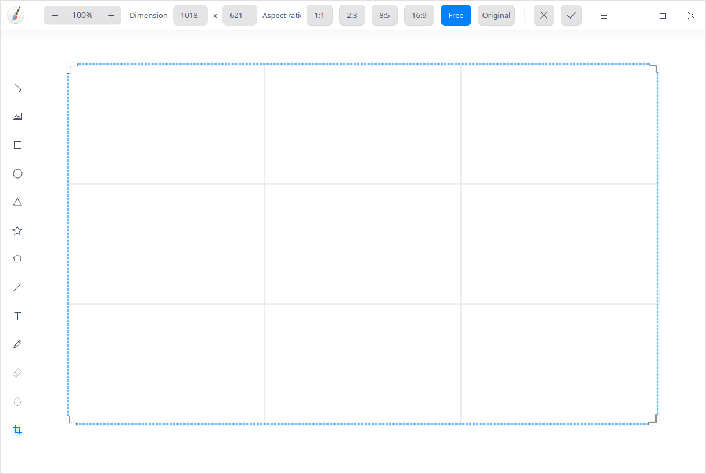

### Flip

1. On the Draw interface, select an imported picture.
2. Click  or  to flip the picture vertically or horizontally.

### Rotate

1. On the Draw interface, select an imported picture.
2. Click  or  to rotate the picture for 90 degrees clockwise or counterclockwise. Or rotate the picture by rotating the icon on the picture.

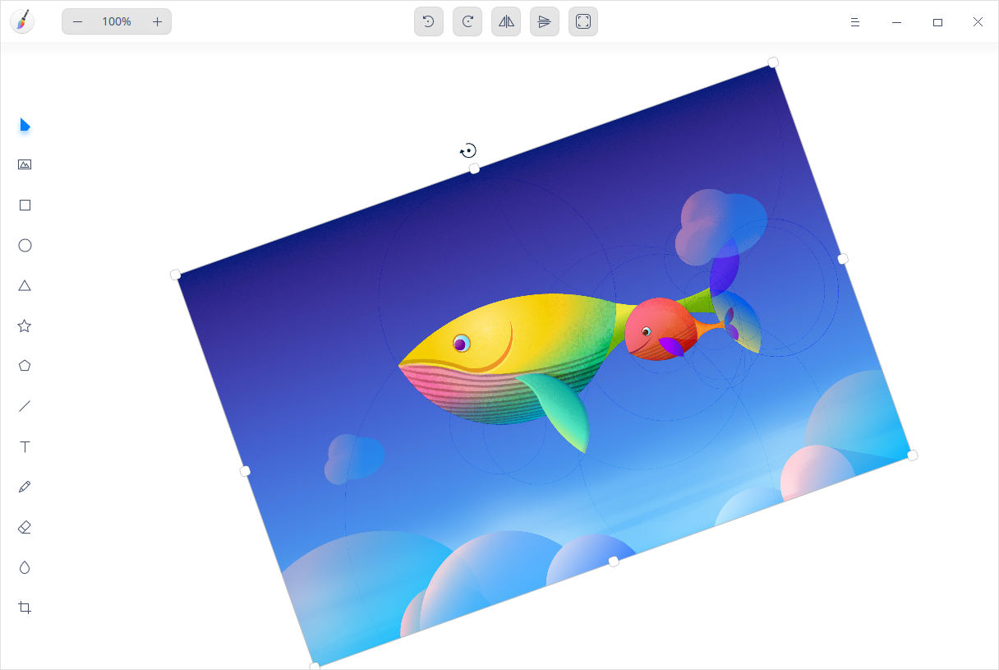

### Auto Fit

1. On the Draw interface, select an imported picture.

2. Click  to adjust canvas size based on the picture.
    - If you choose one picture, the canvas size is adjusted according to the width and height of that picture.
    - If you choose multiple pictures at a time, the canvas size is adjusted according to the biggest range of edges.

### Group/Ungroup

1. Select multiple graphics on the Draw interface.
2. Right-click to select **Group** or click the  on the attribute column to group the graphics.
3. Right-click the graphics grouped and select **Ungroup** or click the  on the attribute column to ungroup the graphics.

>  Tips: You can also press  **Ctrl+G** and  **Ctrl+Shift+G** to group and ungroup graphics respectively. 

### Adjust Layers

1. On the Draw interface, select an imported picture.
2. Right-click **Layer** and select **Raise Layer**, **Lower Layer**, **Layer to Top** or **Layer to Bottom** to adjust the layer order.

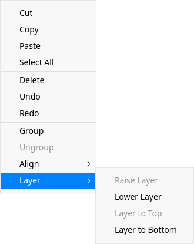

### Align Layers

1. On the Draw interface, select one or several graphics.
2. Right-click and select **Align**. Choose from **Align left**, **Horizontal centers**, **Align right**, **Align top**, **Vertical centers**, **Align bottom**, **Flip horizontally**, and **Distribute vertical space**. 

> Notes: 
>- When you select one graphic, the layer will be aligned with the canvas.
>- When you select 3 or more graphics, **Flip horizontally** and **Distribute vertical space** are available to be selected.

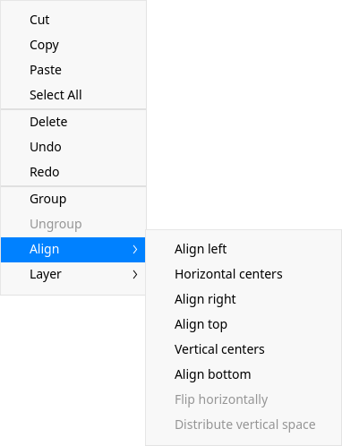

### Align Texts

1. On the Draw interface, click  and adjust the size of the text box.
2. Select target text. Right-click and select **Text Align Left**, **Text Align Right** or **Text Align Center** to align texts.

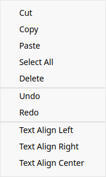
### Copy and Paste

1. On the Draw interface, select the graphics to be copied.
2. Right-click and select **Copy** or use the shortcuts **Ctrl + C** to copy the graphics to the clipboard.
3. Right-click and select **Paste** or use the shortcuts **Ctrl + V** to paste the graphics to Draw.

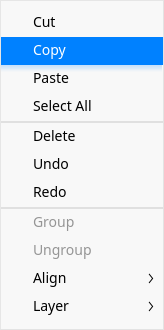

### Delete

1. On the Draw interface, select a graphic or picture.
2. Right-click and select **Delete** or use the **Delete** key on the keyboard to delete the selected graphic or picture.

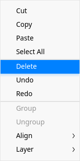

## Main Menu

In the main menu, you can create a new tab, [Open Pictures](#Open Pictures), [Export Pictures](#Export Pictures), [Save Pictures](#Save Pictures), [Print Pictures](#Print Pictures), switch window themes, view help manual, and get more information about Draw.

### New

You can create a new tab.

1.  On the Draw interface, click .
2.  Click **New** to add a new tab.

### Theme

The window theme provides three theme types, namely Light Theme, Dark Theme, and System Theme.

1. On the Draw interface, click .
2. Click **Theme** to select one theme.

### Help

1. On the Draw interface, click .
2. Click **Help** to view the manual of Draw.

### About

1. On the Draw interface, click .
2. Click **About** to view the version and introduction of Draw.

### Exit

1. On the Draw interface, click .
2. Click **Exit** to exit Draw.