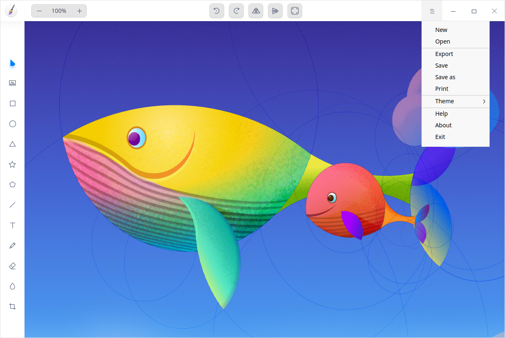
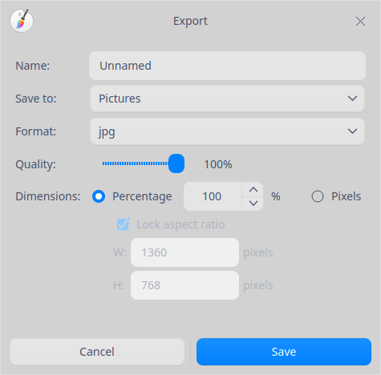
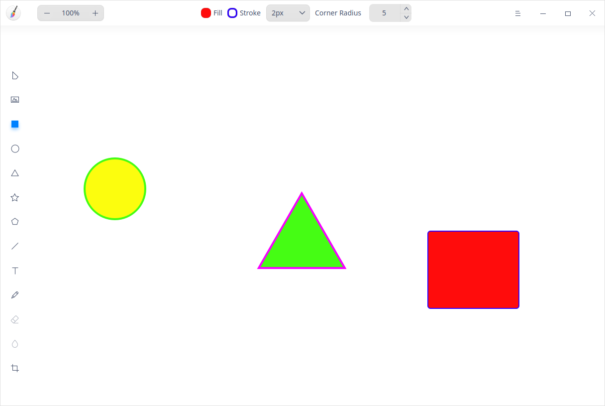
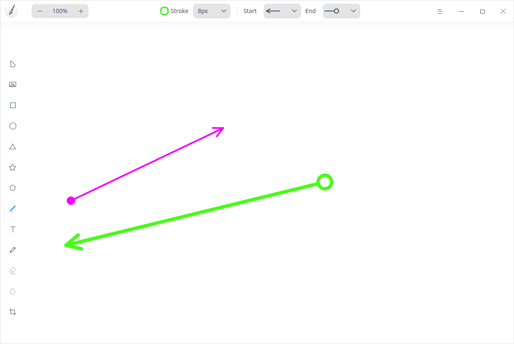
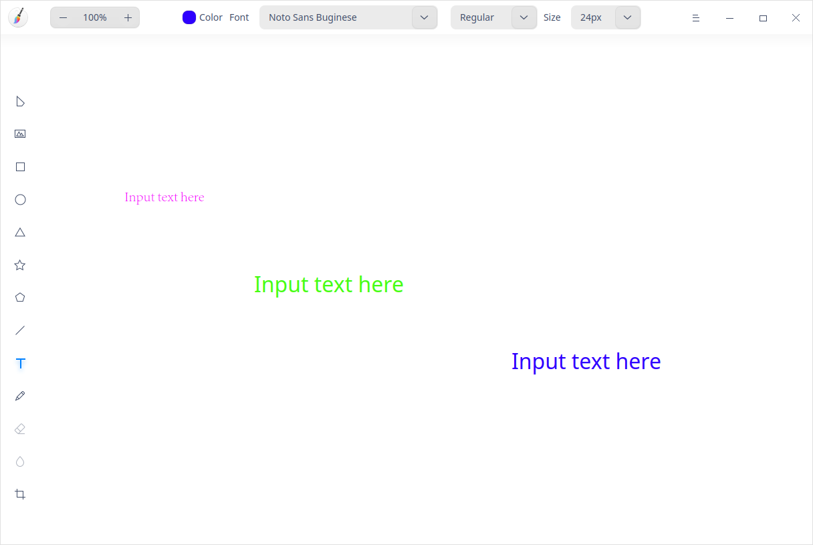
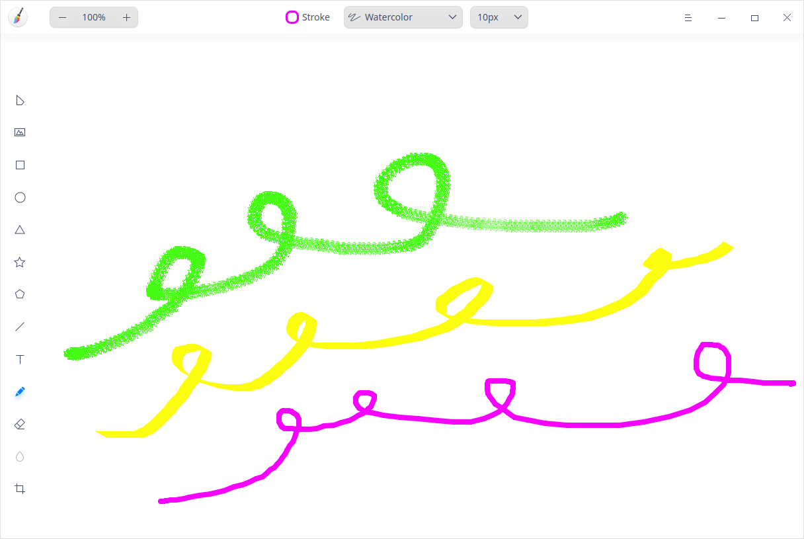
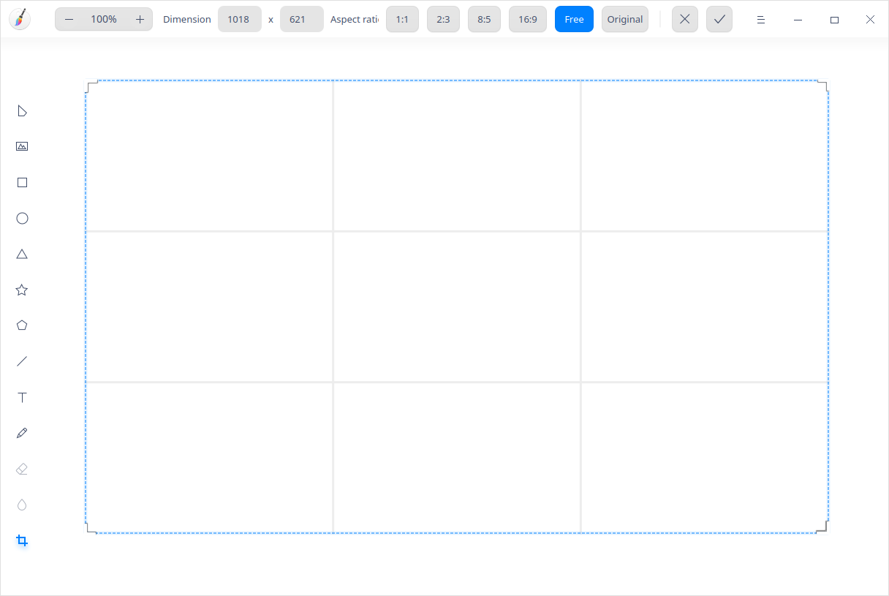
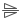
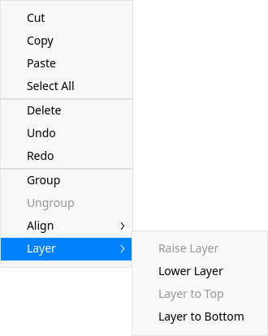

# Draw|deepin-draw|

## Overview

Draw is a lightweight drawing tool, supporting rotation, cropping, flipping, and adding texts and shapes among other functions. You can edit local pictures or draw pictures freely.

The current version of Draw consists of a vertical toolbar on the left, an attributes column at the top, and a tab area: the left vertical toolbar contains the selection, import picture, shape, line, text, pencil, eraser, blur, and crop tools; the top attributes column shows the parameters of the current tool; the tab area is used to switch between multiple canvases.

## Guide

You can run, close, and create a desktop shortcut for Draw in the following ways.

### Run Draw

1. Click the Launcher icon  in the Dock to enter the Launcher interface.
2. Locate Draw  by scrolling the mouse wheel or searching "draw" in the Launcher interface.
3. Right-click  and the user can:
 - Click **Send to desktop** to create a desktop shortcut.
 - Click **Send to dock** to fix the application in the Dock.
 - Click **Add to startup** to add the application to startup and it will automatically run when the system starts up.

Tips: In Control Center, you can set Draw as the defaulted picture viewer. Please refer to [Default Applications](dman:///dde#Default Applications) for specific operations.

### Exit Draw

- On the Draw interface, click  to exit Draw.
- Right-click  in the Dock and select **Close All** to exit Draw.
- Click  on the Draw interface and select **Exit** to exit Draw.

### View Shortcuts

On the Draw interface, press **Ctrl** + **Shift** + **?** on the keyboard to view shortcuts. Proficiency in shortcuts will greatly improve your efficiency.

>  Notes: In the verification environment of this round, pressing **Ctrl** + **Shift** + **?** twice did not bring up the shortcuts window. This manual keeps the key combination for reference only; its actual availability still needs to be confirmed and it has not been verified in this round.

## Basic Functions

With Draw, you are able to process imported pictures and draw pictures freely. You can also export pictures in multiple formats.

### Create tabs

- On the Draw interface, click > **New** to create a new tab with a blank canvas.
- You can also click  to create a new tab when there are two or more tabs in the window.

### Close tabs

- Click a tab. Then click  on the tab to close the current tab.
- Right-click a tab. Select **Close tab** or **Close other tabs**.

### Open Pictures

1. On the Draw interface, click  or  > **Open**.

2. Select the picture to be imported and click **Open**.
   If the dimensions of the picture imported exceeds those of the canvas, there will be a pop-up dialog box for you to choose to keep the original size or fit automatically.

   Currently, a maximum of 30 pictures could be imported. The supported formats have been extended to PNG, JPEG, BMP, TIFF, PPM, XBM, XPM, PGM, PBM, AVIF, HEIF, HEIC and more, and the DDF file of Draw itself is also supported.

### Export Pictures

1. On the Draw interface, click > **Export**.

2. In the export window, set the parameters including file name, save location, format, picture quality and dimensions:
   - Format: select the export format from the drop-down list, including PNG and other common picture formats.
   - Quality: drag the slider to adjust the clarity of the picture.
   - Dimensions: adjust the width and height of the picture by percentage or pixels.
     - By percentage (defaulted): you can custom the percentage and scale up or down the image equally by percentage.
     - By pixels: you can custom the pixels of the image height and width and scale it up or down according to the absolute pixels of the custom height and width. If **Lock aspect ratio** is checked, either of the values will be changed accordingly with the other one.
   - Dimensions: the width and height in pixels of the exported picture are displayed at the bottom of the window in real time.

3. Click **Save**.

>  Notes: In this round, a PNG picture was actually exported with the current version of Draw and the file was confirmed to be saved on disk. The format, quality, percentage/pixels, lock aspect ratio and dimensions can all be set in the export window.

### Save Pictures

1. On the Draw interface, click > **Save** or > **Save as**.
2. Set the file name and format to be saved.
3. Click **Save**.

>  Notes:
> - Draw saves files in DDF format by default so that the graphic objects can be edited later. In this round, a DDF file was actually saved and confirmed to be written to disk.
> - The suffix of the file name can be omitted and it can be added automatically in the process of saving the file.
> - When using **Save as**, you can press **Ctrl + L** in the file chooser to switch to another directory and specify where to save the file.

### Print Pictures

1. On the Draw interface, click > **Print**.
2. Select the printer and set the printing parameters.
3. Click **Print**.

>  Notes: Click **Advanced** to customize the printing parameters. Printing depends on an available printer. No printer was available in the verification environment of this round, so the printing flow was not completed and the steps above are for reference only.

## Drawing Tools

With the drawing tools of Draw, you can give full play to your imagination and creativity for free graphic drawings. All drawing tools are located in the vertical toolbar on the left of the interface.

### Shape Tool

1. On the Draw interface, click , , ,  or  in the vertical toolbar on the left.
2. You can set the parameters for graphics in the attributes column as follows:
   - Click **Fill** to set the fill color and transparency for graphics.
   - Click **Stroke** to set the stroke color and transparency for graphics pen.
   - Choose and set the weight of Stroke from the drop-down list right to the **Stroke** button.
   - Use **Corner Radius** to set the corner radius when drawing a rectangle.
   - Click **Points** (from 3 to 50) and **Radius** (from 0% to 100%) to set the points and radius for star graphics only.
   - Click **Sides** (from 4 to 10) to set sides for polygon graphics only.

   > Tips: The number of sides, points and radius can be adjusted by clicking  or  in the attributes column, scrolling the mouse wheel or pressing  or  on the keyboard after selecting the value of sides, points or radius.
3. Drag the mouse to draw graphics in the canvas area.

> Tips: Facilitated by **Shift** or **Shift + Alt** on the keyboard, you can draw a square, circle, equilateral triangle, regular pentagram, and regular pentagon when drawing graphics with , , ,  and .

### Line Tool

1. On the Draw interface, click  in the vertical toolbar on the left.

2. You can set parameters for your lines in the attributes column as follows:
   - Click **Stroke** to set the color and transparency of the line.
   - Select the weight of line from the drop-down list.
   - Click **Start** to choose the style of the starting point of lines.
   - Click **End** to choose the style of the ending point of lines.

3. Drag the mouse in the canvas area to draw lines.

### Text Tool

1. On the Draw interface, click  in the vertical toolbar on the left.

2. You can set text styles in the attributes column as follows:
   - Click **Color** to set the fill color and transparency of texts.
   - Select the font style in the **Font** drop-down list.
   - Select the font style such as **Regular** or bold in the drop-down list.
   - Adjust the **Size** by entering a value manually or selecting a size in the drop-down list.

3. Click in the canvas area to enter texts in the text box.

>Tips: You can use shortcuts to adjust the font size. When font is under editing, click the font size right to the **Size** icon and click the  or  key on the keyboard to adjust the font size.

### Pencil Tool

1. On the Draw interface, click  in the vertical toolbar on the left.
2. You can set parameters for your pencil in the attributes column as follows:
   - Click **Stroke** to set the color and transparency of the pencil.
   - Select the pencil style from the drop-down list. The style list includes **Watercolor**.
   - Select the weight of the pencil from the drop-down list.
3. Drag the mouse on the canvas area to draw graphics.
4. Click the  icon to select and edit the graphic.

### Eraser Tool

1. On the Draw interface, import a picture or draw a graphic with the pencil.
2. Click the  icon in the vertical toolbar on the left and set the width for the eraser in the attributes column.
3. Hold on and drag the left key of the mouse to erase the part of the picture or graphic as needed.

### Blur Tool

1. On the Draw interface, import a picture and click  in the vertical toolbar on the left.
2. Select the blur **Type**, including **Blur** and **Mosaic**.
3. Change the blur area width by clicking the up or down arrow in **Width**.
4. Drag the mouse in the canvas area to blur the area as needed.

>  Notes: The blur tool is only applicable for pictures.

## Edit Functions

You can copy, crop, and rotate graphics with the editing functions, and also adjust layers and texts.

### Select

After drawing entities with the graphics drawing tool, you can perform the following operations:

- Select drawn graphics or texts.
- Perform marquee selection and all graphics within the marquee selection area are put under selected status.
- Drag to adjust the size of the graphic within the selected area.
- Hold down the **Shift** key and click to select multiple graphics.

>  Notes: Click the blank area in Draw to cancel the graphics selected.

### Crop

1. On the Draw interface, click  in the vertical toolbar on the left to enter the cropping mode.
2. Set the dimension and ratio in the attributes column.
   - Dimension: enter the width and height manually to customize the canvas cropping.
   - Ratio: select the preset ratio such as **1:1**, **2:3**, **8:5** and **16:9**, or select **Free** or **Original** to crop the canvas.

3. Press the **Enter** key or the icon in the attributes column to crop the canvas.

### Flip

1. On the Draw interface, select an imported picture.
2. Click  or  to flip the picture vertically or horizontally.

### Rotate

1. On the Draw interface, select an imported picture.
2. Click  or  to rotate the picture for 90 degrees clockwise or counterclockwise. Or rotate the picture by dragging the rotation handle  above the picture with the left mouse button.

### Auto Fit

1. On the Draw interface, select an imported picture.

2. Click  to adjust canvas size based on the picture.
    - If you choose one picture, the canvas size is adjusted according to the width and height of that picture.
    - If you choose multiple pictures at a time, the canvas size is adjusted according to the biggest range of edges.

### Group/Ungroup

1. Select multiple graphics on the Draw interface.
2. Right-click to see **Group** in the context menu, or click the  in the attributes column to group the graphics.
3. Right-click the graphics grouped to see **Ungroup** in the context menu, or click the  in the attributes column to ungroup the graphics.

>  Notes: In this round, the **Group** and **Ungroup** entries were confirmed to be visible in the context menu when multiple graphics are selected, but the actual result of grouping and ungrouping has not formed a reviewable closed loop. This manual therefore only describes the entries and does not make any conclusion on the execution result.
>  Tips: You can also press **Ctrl+G** and **Ctrl+Shift+G** to group and ungroup graphics respectively.

### Adjust Layers

1. On the Draw interface, select an imported picture.
2. Right-click **Layer** and select **Raise Layer**, **Lower Layer**, **Layer to Top** or **Layer to Bottom** to adjust the layer order.

>  Notes: In this round, the **Layer** entry and its submenu were confirmed to be visible in the context menu, but the actual layer adjustment has not been closed in this round; the operation above is an entry description.

### Align Layers

1. On the Draw interface, select one or several graphics.
2. Right-click and select **Align**. Choose from **Align left**, **Horizontal centers**, **Align right**, **Align top**, **Vertical centers**, **Align bottom**, **Flip horizontally**, and **Distribute vertical space**.

> Notes:
>- When you select one graphic, the layer will be aligned with the canvas.
>- When you select three or more graphics, **Flip horizontally** and **Distribute vertical space** are available to be selected.
>- In this round, the **Align** entry and its submenu were confirmed to be visible in the context menu when multiple graphics are selected, but the execution result of each alignment option has not been closed in this round; the operation above is an entry description.

### Align Texts

1. On the Draw interface, click  and adjust the size of the text box.
2. Select target text. Right-click and select **Text Align Left**, **Text Align Right** or **Text Align Center** to align texts.

>  Notes: The Align Texts entry follows the original description of the system and has not been independently verified in this round.

### Copy and Paste

1. On the Draw interface, select the graphics to be copied.
2. Right-click and select **Copy** or use the shortcuts **Ctrl + C** to copy the graphics to the clipboard.
3. Right-click and select **Paste** or use the shortcuts **Ctrl + V** to paste the graphics to Draw.

>  Notes: The Copy and Paste entries follow the original description of the system and have not been independently verified in this round.

### Delete

1. On the Draw interface, select a graphic or picture.
2. Right-click and select **Delete** or use the **Delete** key on the keyboard to delete the selected graphic or picture.

>  Notes: The Delete entry follows the original description of the system and has not been independently verified in this round.

## Main Menu

In the main menu, you can create a new tab, [Open Pictures](#open-pictures), [Export Pictures](#export-pictures), [Save Pictures](#save-pictures), [Print Pictures](#print-pictures), switch window themes, view help manual, and get more information about Draw.

### Theme

There are three window themes, namely Light Theme, Dark Theme, and System Theme.

1. On the Draw interface, click .
2. Click **Theme** to select one theme.

>  Notes: In this round, the **Theme** entry was confirmed to be visible in the main menu, but theme switching was not independently verified.

### Help

1. On the Draw interface, click .
2. Click **Help** to view the manual of Draw.

>  Notes: In this round, the **Help** entry was confirmed to be visible in the main menu, but opening the manual was not independently verified.

### About

1. On the Draw interface, click .
2. Click **About** to view the version and introduction of Draw.

>  Notes: The About window shows the current version **6.0.11.6**.

### Exit

1. On the Draw interface, click .
2. Click **Exit** to exit Draw.
