# 畫板|deepin-draw|

## 概述

畫板是一款簡單的繪圖工具，支援旋轉、裁剪、翻轉、添加文字、繪製形狀等功能。您可以對本機圖片進行簡單編輯，也可以繪製一張簡單圖片。

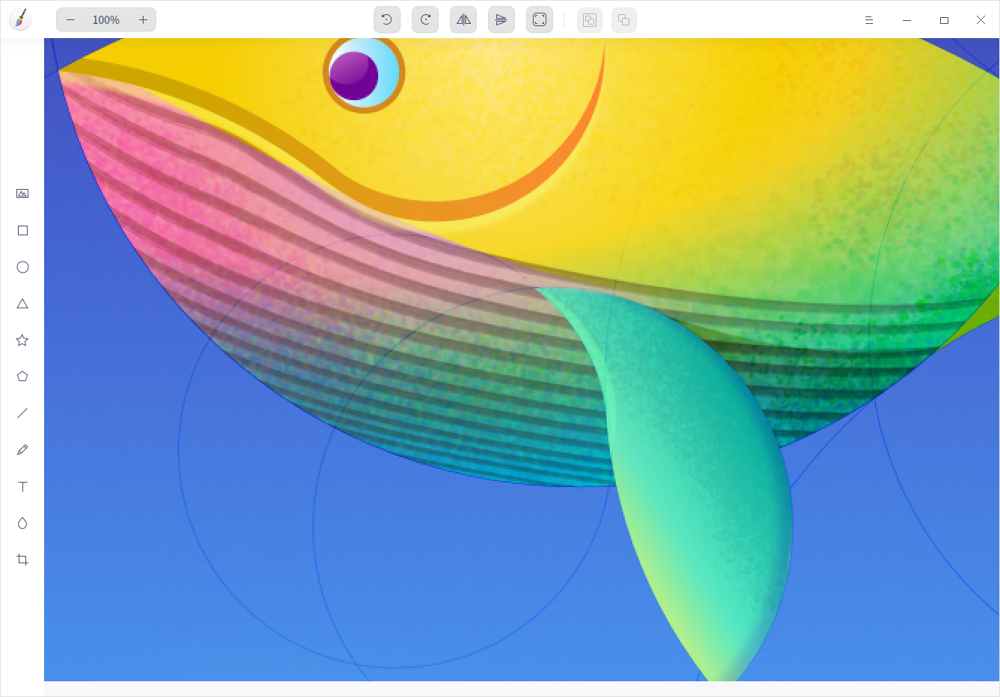

## 使用入門

透過以下方式執行或關閉畫板，或者建立畫板的捷徑。

### 執行畫板

1. 單擊任務欄上的啟動器圖示 ，進入啟動器介面。
2. 上下滾動滑鼠滾輪瀏覽或透過搜尋，找到畫板  單擊執行。
3. 右鍵單擊 ，您可以：
 - 單擊 **建立桌面捷徑**，在桌面建立捷徑。
 - 單擊 **釘選到Dock**，將應用程式固定到Dock。
 - 單擊 **開機啟動**，將應用程式添加到開機啟動項，在電腦開機時自動執行該應用。

 竅門：您可以在控制中心中將畫板設定為預設的圖片查看程式，具體操作請參考 [預設程式設定](dman:///dde#預設程式設定)。

### 關閉畫板

- 在畫板介面單擊  ，關閉畫板。
- 在任務欄右鍵單擊 ，選擇 **全部關閉**，關閉畫板。
- 在畫板介面單擊 ，選擇 **退出**，關閉畫板。

### 查看快捷鍵

在畫板介面，使用快捷鍵 **Ctrl + Shift + ?** 打開快捷鍵預覽介面。熟練地使用快捷鍵，將大大提升您的操作效率。

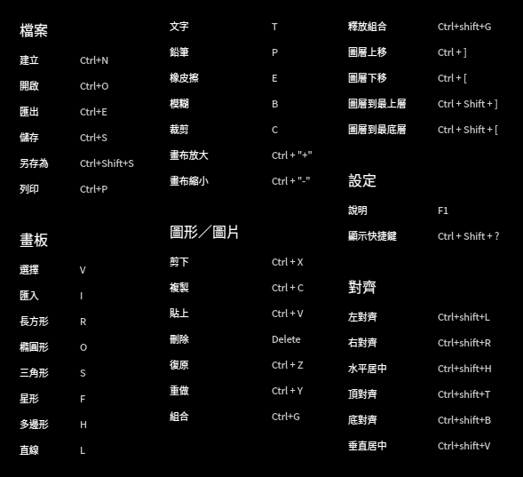

## 常用功能

使用畫板可以處理圖片，繪製圖形，並可以匯出多種圖片格式。

### 建立標籤頁

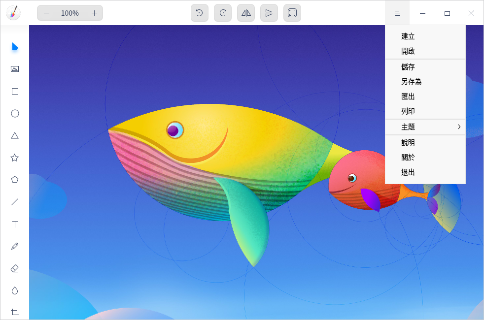

- 在畫板介面，單擊  > **建立**，建立標籤頁。
- 當視窗有兩個或兩個以上標籤頁時，也可以單擊 ， 建立標籤頁。

### 關閉標籤頁

- 滑鼠左鍵單擊標籤頁，單擊  按鈕關閉目前標籤頁。
- 滑鼠右鍵單擊標籤頁，選擇 **關閉標籤頁** 或 **關閉其他標籤頁**。

### 開啟圖片

1. 在畫板介面，單擊 或 > **開啟**。
2. 選擇想要匯入的圖片，單擊 **開啟** 匯入圖片。如果圖片尺寸超出畫布區域，會彈出對話框，您可以選擇保留原圖尺寸或適應畫布大小。

目前最多只能匯入30張圖片，支援的圖片格式為JPG、PNG、TIF、BMP和DDF。

### 匯出圖片

1. 在畫板介面，單擊  > **匯出**。
2. 設定儲存檔案名、路徑、檔案格式、圖片品質、圖片尺寸。其中，圖片尺寸可以按百分比或像素進行設定：
   + 百分比：預設選項，您可以自訂百分比數值，圖片會根據數值等比縮放。
   + 像素：您可以自訂圖片寬高像素值，將原圖按自訂寬高的絕物件素值進行縮放。如果勾選了 **保持寬高比**，寬或高會隨著另一項自動等比調整。
3. 單擊 **儲存**。

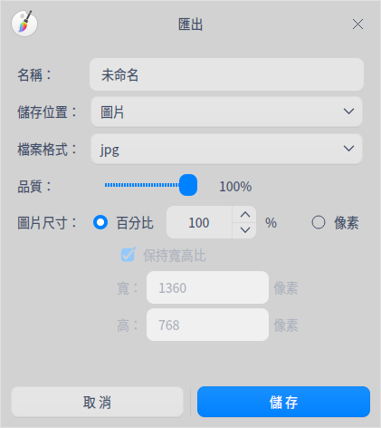

### 儲存圖片

1. 在畫板介面，單擊  > **儲存** 或  > **另存為**。
2. 設定儲存的檔案名、格式。
3. 單擊 **儲存**。

>  說明：填寫儲存檔案名時可以省略副檔名，系統會在檔案名後自動加上副檔名。

### 列印圖片

1. 在畫板介面，單擊  > **列印**。
2. 選擇印表機，設定列印參數。
3. 單擊 **列印**。

>  說明：單擊 **進階設定** 可以自訂列印效果。

## 繪畫工具

使用畫板的繪畫工具，可以充分發揮您的想像力和創造力，自由繪製各種圖形。

### 形狀工具

1. 在畫板介面，單擊  或  或  或  或 。
2. 在屬性欄中設定圖形的參數：
   - 顏色：單擊 **填充** 設定圖形的填充顏色和不透明度。
   - 描邊：單擊 **描邊** 設定圖形的描邊顏色和不透明度。
   - 粗細值：在粗細值下拉框中設定圖形的描邊粗細。
   - 錨點數/半徑值：設定錨點數（取值範圍為3-50個）和半徑值（取值範圍為0%-100%），僅適用於星型。
   - 側邊數：設定側邊數（取值範圍為4-10條），僅適用於多邊形。
   
   > 竅門：錨點數、半徑值和側邊數既可以透過單擊 或 按鈕調節，也可以選中數值後使用鍵盤  或  鍵或滾動滑鼠調節。
3. 在畫布區域拖動滑鼠繪製形狀。

>  竅門：在使用  或  或  或  或 繪製圖形時，配合鍵盤上的 **Shift** 或 **Shift + Alt** 鍵可以畫出正方形、正圓、正三角、正星形多角形、正多邊形。

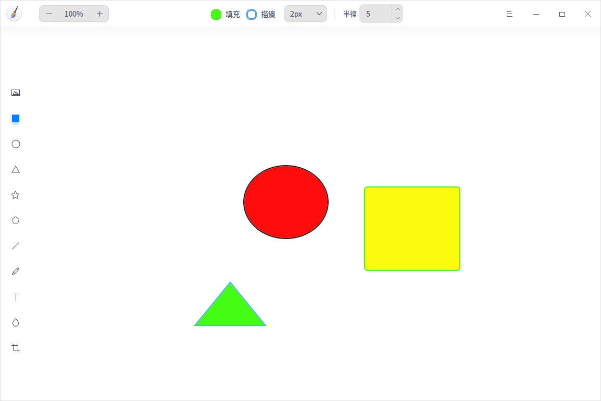

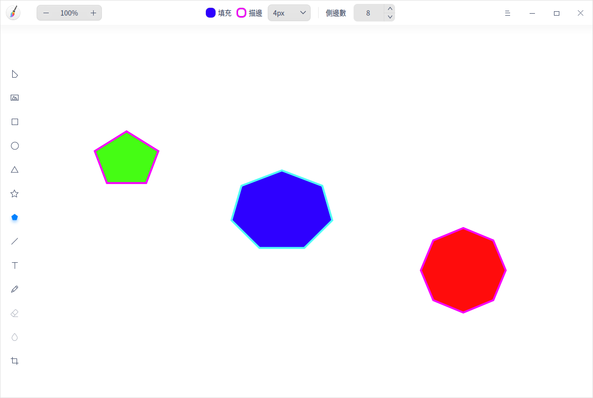

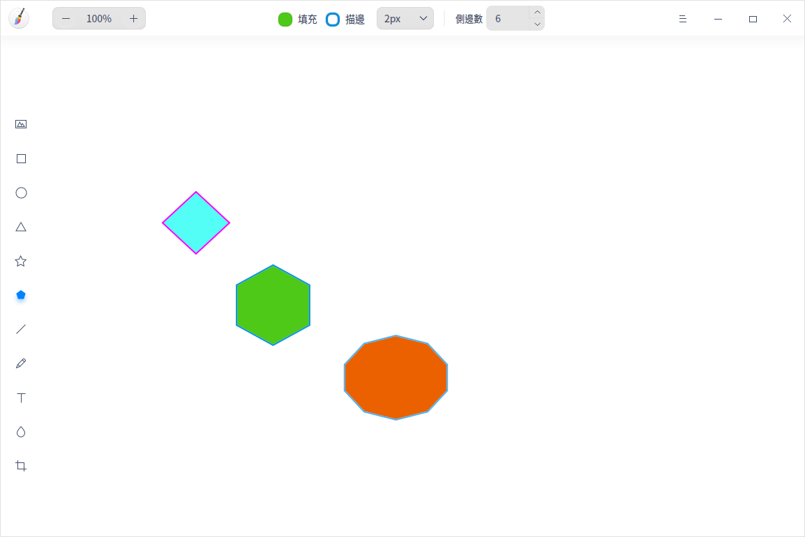

### 直線工具

1. 在畫板介面，單擊  。
2. 在屬性欄中設定直線或畫筆參數：
   - 描邊：單擊 **描邊** 設定畫筆的顏色和不透明度。
   - 粗細值：在粗細值下拉框中選擇畫筆的粗細值。
   - 樣式：設定直線的起點和終點樣式。
3. 在畫布區域拖動滑鼠繪製直線。

### 文字工具

1. 在畫板介面，單擊 。
2. 在屬性欄中設定文字樣式：
   - 顏色：單擊 **顏色** ，設定文字的填充顏色和不透明度。
   - 字體：在 **字體** 下拉框中選擇字體樣式。
   - 字型：設定一般字體或加粗字體。
   - 字號：在 **字號**下拉框中選擇字號大小。
3. 在畫布區域單擊滑鼠後在文字框中輸入文字。

> 竅門：您可以使用快捷鍵調節字號大小：當字體處於編輯狀態時，單擊屬性欄上的字號大小，按下鍵盤上的  鍵或  鍵調節大小。

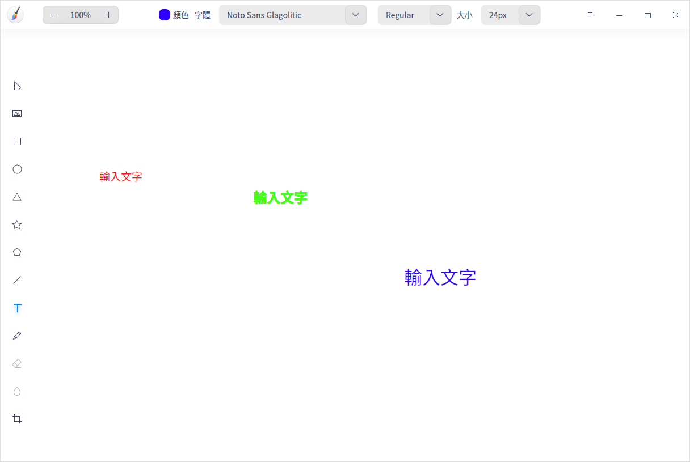

### 鉛筆工具

1. 在畫板介面，單擊 。
2. 在屬性欄中設定鉛筆參數：

   - 描邊：單擊 **描邊** 設定畫筆的顏色和不透明度。
   - 樣式：選擇鉛筆的書寫樣式。
   - 粗細值：在粗細值下拉框中設定畫筆的粗細值。
3. 在畫布區域拖動滑鼠繪製形狀。
4. 單擊工具列中的選擇按鈕 選中圖形後可以對其進行編輯。

### 橡皮擦工具

1. 在畫板介面，匯入圖片或使用鉛筆工具繪製圖形。
2. 單擊 。
3. 在屬性欄中設定橡皮擦的寬度。
4. 按住滑鼠左鍵不放並拖動滑鼠，對圖片或鉛筆繪製的圖形進行局部擦除。

### 模糊工具

1. 在畫板介面，匯入圖片。
2. 單擊 。
3. 在屬性欄中選擇模糊類型，設定塗抹區域的粗細值。
4. 在圖片上拖動滑鼠塗抹需要模糊的區域。

>   說明：模糊工具僅對圖片操作有效，對圖形操作無效。

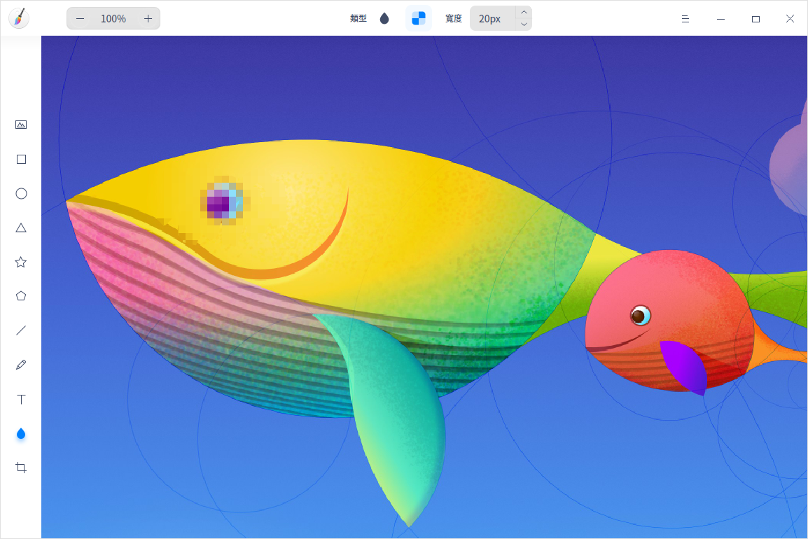

## 編輯功能
使用畫板的編輯功能可對圖形進行複製、裁剪、旋轉等操作；也可對圖層和文字進行調整。
### 選擇

繪製圖形後，可以進行以下操作：

- 對已繪製圖形、文字進行選擇。
- 支援拖動滑鼠框選圖形，框選中的圖形變為選擇狀態。
- 處於選擇狀態中的圖形，可拖曳邊緣調整其大小。
- 支援按住 **Shift** 鍵，選擇多個圖形。

>  說明：單擊畫板空白區域，取消目前已選圖形。

### 裁剪

1. 在畫板介面，單擊 。
2.  在屬性欄中選擇裁剪模式。
  - 自由：手動輸入尺寸或拖動裁剪邊框，自訂裁剪畫布。
  - 原始：按照原圖比例截取，如1:1、2:3、8:5、 16:9。

3. 按 **Enter** 鍵或單擊屬性欄上的，裁剪畫布。

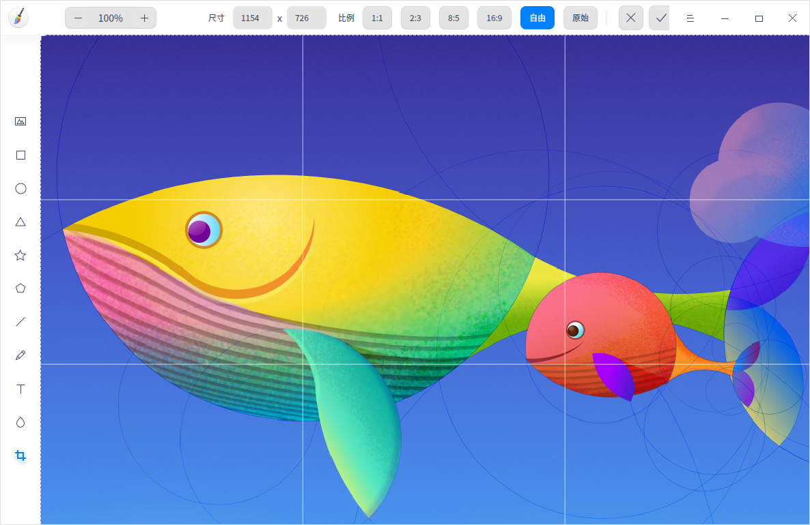

### 翻轉

1. 在畫板介面，選擇已匯入的圖片。
2. 單擊 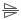 或  將圖片垂直翻轉或水平翻轉。

### 旋轉

1. 在畫板介面，選中圖片。
2. 單擊  或  將圖片順時針或逆時針旋轉90°或滑鼠左鍵按住旋轉按鈕  不放旋轉圖片。

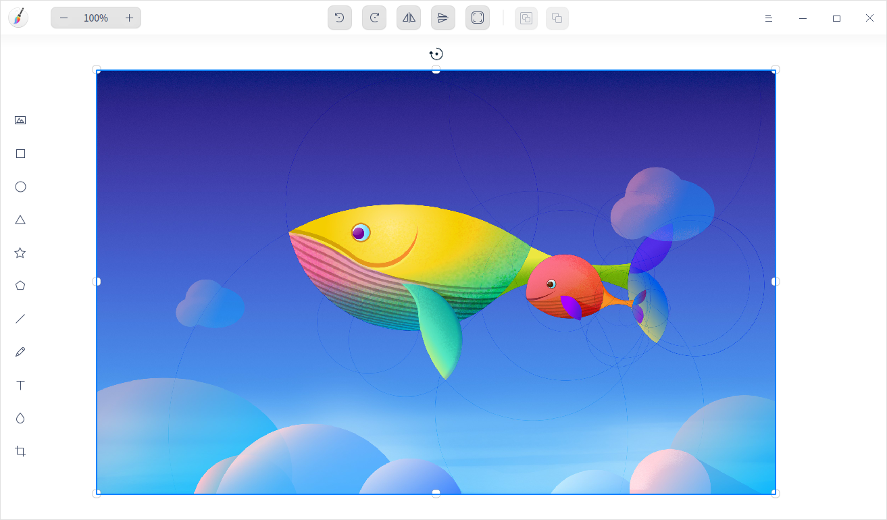

### 自適應畫布

1. 在畫板介面，選中圖片。
2. 單擊 ，根據圖片自適應畫布大小。
   - 若選擇單張圖片，根據圖片的寬高來調整畫布大小。
   - 若選擇多張圖片，根據最大邊界範圍調整畫布大小。

### 組合/釋放組合

1. 在畫板介面，選中多個圖形。
2. 單擊滑鼠右鍵選擇 **組合** 或單擊屬性欄上的圖示將圖形組合。
3. 右鍵單擊已組合的圖形，選擇 **釋放組合** 或單擊屬性欄上的圖示將已組合的圖形釋放。

>  竅門：您也可以使用快捷鍵 **Ctrl+G** 組合圖形和 **Ctrl+Shift+G** 釋放組合。

### 調整圖層

1. 在畫板介面，選中圖形。
2. 單擊滑鼠右鍵選擇 **圖層**，在其下拉選單選擇 **向上一層**、**向下一層**、**置於頂層** 或 **置於底層** 調整圖層順序。

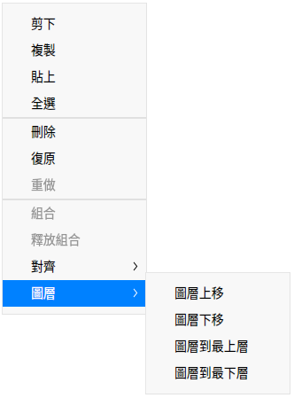

### 對齊圖層

1. 在畫板介面，選中一個或多個圖形。
2. 單擊滑鼠右鍵選擇 **對齊**，在其下拉選單選擇 **左對齊**、**水平居中**、**右對齊**、**頂對齊**、**垂直居中**、**底對齊**、**水平等間矩** 或 **垂直等間矩** 調整圖層對齊方式。

> 說明：
   >- 僅選中一個圖形進行操作時，圖層則與畫布對齊。
   >- 選中三個或三個以上的圖形時，才能進行「水平等間矩」和「垂直等間矩」的操作。

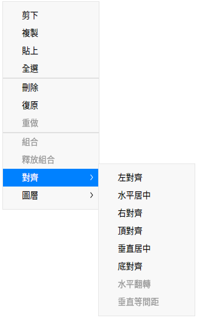

### 對齊文字

1. 在畫板介面，單擊 ，調整文字框大小。
2. 選中文字內容後單擊滑鼠右鍵選擇 **左對齊**、**右對齊**、**居中對齊** 對齊文字。

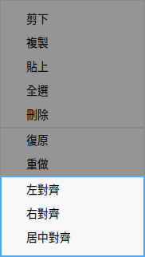
### 複製和貼上

1. 在畫板介面，選中需要複製的圖形。
2. 單擊滑鼠右鍵選擇 **複製** 或 使用快捷鍵 **Ctrl + C** 將圖形複製到剪貼簿。
3. 單擊滑鼠右鍵選擇 **貼上** 或 使用快捷鍵 **Ctrl + V** 將圖形貼到畫板上。

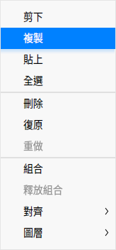
### 刪除

1. 在畫板介面，選中圖形。
2. 單擊滑鼠右鍵選擇 **刪除**或使用快捷鍵 **Delete** 將選中的圖形刪除。

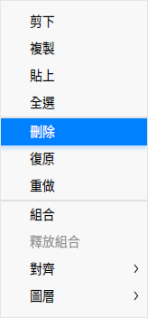
## 主選單

在主選單中，您可以建立標籤頁、[開啟圖片](#開啟圖片)、[匯出圖片](#匯出圖片)、儲存圖片、切換視窗主題、查看說明手冊，了解畫板的更多資訊。

### 建立

您可以透過建立添加一個標籤頁。

1. 在畫板介面，單擊 。
2. 單擊 **建立**，添加一個標籤頁

### 主題

視窗主題包含亮色主題、暗色主題和系統主題。

1. 在畫板介面，單擊 。
2. 單擊 **主題**，選擇一個主題顏色。

### 說明

查看說明手冊，進一步了解和使用畫板。

1. 在畫板介面，單擊 。
2. 單擊 **說明**。
3. 查看畫板的說明手冊。

### 關於

1. 在畫板介面，單擊 。
2. 單擊 **關於**。
3. 查看畫板的版本和介紹。

### 退出

1. 在畫板介面，單擊 。
2. 單擊 **退出**。
